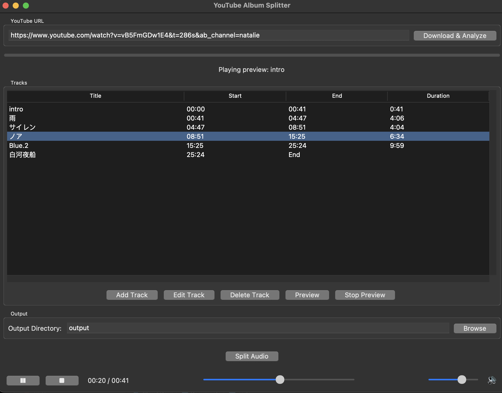

# yt-mp3-slicer

I got tired of manually splitting MP3s from albums I could only find on youtube. 

**Installation:**

1. `pip install -r requirements.txt`

2. You will need ffmpeg to make this work:

- Windows: Download from https://ffmpeg.org/download.html
- macOS: `brew install ffmpeg`
- Linux: `sudo apt install ffmpeg` (Ubuntu/Debian) or equivalent for your distro

3. Run: `python youtube_splitter.py`

